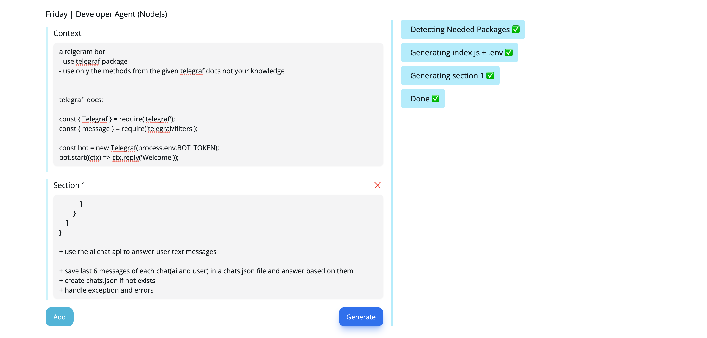

# Friday: AI-Powered App Generation Tool

Friday is a developer agent that helps you quickly create applications with AI assistance. It provides a core prompt for building the foundation of your application and allows you to add unlimited sections, each of which is a prompt representing a specific part of your app.



For demos and examples, please visit my Twitter profile: [Twitter](https://twitter.com/amirsalimiiii)

Join our Discord server for support, discussions, and to share your feedback, ideas, and the apps you've created with Friday: [Discord](https://discord.gg/gnjutQvwah)

## Features

- Friday utilizes GPT-4 for AI assistance, but it has been tested and optimized with GPT-4-32k for improved speed and better results.
- It requires 2 small requests for your app's base and 1 request per section you provide.
- Friday employs esbuild behind the scenes for every app created by it.

# Friday: Usage Manual

To use Friday, you should have access to a GPT-like chat completion API, such as GPT-4 or GPT-4-32k. The file structure of the project is as follows:

- `core`: Friday's core module.
- `web`
  - `frontend`: Frontend module for the application.
  - `backend`: Backend module for the application.

Follow the steps below to set up and use Friday:

1.Go to the `web/backend` directory and open the `.env` file. Fill in your AI API key and endpoint. You can use the official OpenAI endpoint: `https://api.openai.com/v1/chat/completions`

```
AI_TOKEN=
AI_ENDPOINT=
```

2.Build the core module by navigating to the `core` directory and executing the following commands:

```bash
cd core
npm install
npm run build
```

3.Run the backend server by navigating to the `web/backend` directory and executing the following commands:
```bash
cd web/backend
npm install
npm run start
```

4.Run the frontend module by navigating to the `web/frontend` directory and executing the following commands:
```bash
cd web/frontend
npm install
npm run start
```
Make sure to install the necessary dependencies by running `npm install` for both the backend and frontend directories, especially if it's your first time setting up the project.

Now you should be able to access and use Friday through the frontend interface. on http://localhost:5173

> after getting "Done" message in ui , your project will create on the `projects/last` directory
1. check .env file and change it if need 
2. run `npm i` to install packages
3. run `npm run start` to start your project


## Known Bugs

- Occasionally, Friday may not include used packages in the `packages.json` file. If you encounter missing packages after running `npm run start`, please install them manually.

## Future Goals

- Enhance the scalability of Friday for multi-file apps with a well-defined structure. Currently, it primarily generates an `index.js` and `.env` file for the entire application.
- Improve the user interface of the panel for a more intuitive experience.
- Implement a documentation feature, allowing you to attach API or package documentation to your app prompt with just one click.
- Introduce a code debugger for easier troubleshooting.


## License

This project is licensed under the MIT License.
